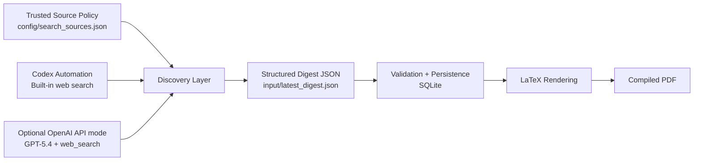

# AI Daily Digest Agent

[中文说明](./README.zh-CN.md)

An agent-assisted reporting pipeline that discovers high-signal AI updates, normalizes them into a structured digest JSON, and renders a daily LaTeX PDF report. The project supports both a Codex-automation workflow and an optional OpenAI API workflow using `GPT-5.4` plus `web_search`.

## Why this project

This project is designed as a reporting-oriented AI intelligence workflow with explicit source governance and structured output.

- It separates information discovery from document rendering through a structured JSON contract.
- It supports two execution modes:
  - `Codex automation mode` for day-to-day local use without local API credentials.
  - `OpenAI API mode` for portable, fully self-contained reproduction and showcase purposes.
- It applies explicit source-governance rules to keep discovery scope controlled and auditable.
- It produces auditable PDF reports suitable for review, archival, and recurring reporting workflows.

## What it does

1. Search recent AI updates from trusted source scopes.
2. Select `3-5` high-confidence items.
3. Allow up to `14` days of backfill if there are not enough current-window items.
4. Generate concise Chinese summaries.
5. Save a structured digest JSON payload.
6. Render and compile a LaTeX PDF digest.

## Architecture



## Source policy

The search scopes are defined in [config/search_sources.json](./config/search_sources.json).

Current categories:

- Official channels
- Authoritative institutions
- High-quality media
- High-signal GitHub community posts

## Execution modes

### 1. Render mode

Default local mode. The project reads a structured JSON file produced by automation and renders the PDF. This mode does not require `OPENAI_API_KEY`.

```powershell
.\scripts\run_digest.ps1 --input input\latest_digest.json
```

### 2. API mode

Optional showcase mode for portable reproduction. This mode uses `GPT-5.4` plus the `web_search` tool through the OpenAI API, writes the digest JSON, and then renders the PDF.

Install the optional dependency first:

```powershell
.venv\Scripts\python -m pip install -e .[dev,api]
```

Set `OPENAI_API_KEY` before running API mode. This requirement applies only to `API mode`, not to the default local rendering workflow.

Run:

```powershell
.venv\Scripts\python -m ai_news_digest --mode api --input input\latest_digest.json
```

## Example digest JSON

See [input/latest_digest.example.json](./input/latest_digest.example.json).

## Local setup

```powershell
python -m venv .venv
.venv\Scripts\python -m pip install --upgrade pip
.venv\Scripts\python -m pip install -e .[dev]
```

For the showcase API path:

```powershell
.venv\Scripts\python -m pip install -e .[dev,api]
```

## Verification

```powershell
.venv\Scripts\python -m pytest -q
.\scripts\run_digest.ps1 --input input\latest_digest.example.json --dry-run
```

## Repo structure

- `config/search_sources.json`: trusted domains and source hints
- `input/`: structured digest JSON examples
- `scripts/run_digest.ps1`: Windows entrypoint
- `src/ai_news_digest/`: core package
- `templates/`: LaTeX template
- `tests/`: automated tests

## Highlights for AI agent / software engineering roles

- Agent workflow design with clear tool and state boundaries
- Dual-mode execution strategy for both daily use and portable reproduction
- Optional `OPENAI_API_KEY` execution path for API-driven discovery and summarization
- Structured intermediate representation between discovery and rendering
- Deterministic document generation with LaTeX and PDF compilation
- Test-covered local pipeline with SQLite-backed run state

## License

[MIT](./LICENSE)
