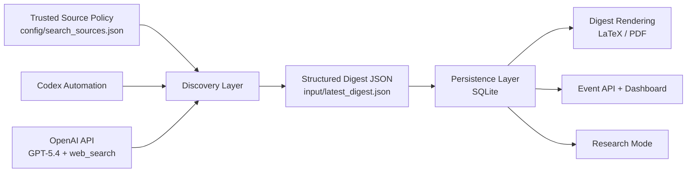

# AI Daily Digest Agent

[中文说明](./README.zh-CN.md)

An agent-augmented AI intelligence system for discovering high-signal updates, extracting structured events, and generating research-ready reports from trusted sources.

## Overview

This repository started as a daily AI digest pipeline and has been expanded into a small intelligence workbench with:

- source-governed discovery
- structured event extraction
- historical retrieval
- entity and topic tracking
- persisted research reports
- lightweight local API and dashboard

The project supports both a local automation workflow and an OpenAI API workflow using `GPT-5.4` plus `web_search`.

## Core Capabilities

- Discover recent AI updates from trusted source scopes.
- Select `3-5` high-confidence digest items with optional backfill.
- Generate concise Chinese summaries plus structured event metadata.
- Persist items, events, digest runs, and research reports in SQLite.
- Search history, events, entities, and topics from the command line or API.
- Run a basic research workflow over stored events, with optional live enrichment.
- Render LaTeX/PDF digests and topic-specific reports.

## Architecture



## Quick Start

Create a virtual environment and install the base package:

```powershell
python -m venv .venv
.venv\Scripts\python -m pip install --upgrade pip
.venv\Scripts\python -m pip install -e .[dev]
```

Install the optional API dependency when you want live OpenAI-backed discovery:

```powershell
.venv\Scripts\python -m pip install -e .[dev,api]
```

## Common Workflows

### 1. Render an Existing Digest

```powershell
.\scripts\run_digest.ps1 --input input\latest_digest.json
```

### 2. Generate a Digest Through the OpenAI API

```powershell
.venv\Scripts\python -m ai_news_digest --mode api --input input\latest_digest.json
```

### 3. Write Per-Topic Reports

```powershell
.venv\Scripts\python -m ai_news_digest --mode api --write-topic-reports
```

### 4. Search Stored History

```powershell
.venv\Scripts\python -m ai_news_digest --history-query "agent" --source "OpenAI News" --entity "Responses API" --date-from 2026-04-01 --date-to 2026-04-10
```

### 5. Search Persisted Events

```powershell
.venv\Scripts\python -m ai_news_digest --event-query "agent" --event-type product-release --entity "OpenAI" --sort-by confidence --limit 10
```

### 6. Show an Entity Timeline

```powershell
.venv\Scripts\python -m ai_news_digest --entity-timeline "OpenAI" --limit 10
```

### 7. Run Research Mode

Generate a research report from persisted events:

```powershell
.venv\Scripts\python -m ai_news_digest --research-query "最近两周 OpenAI agent 相关变化" --limit 8
```

Generate and save the report to Markdown, with optional live enrichment:

```powershell
.venv\Scripts\python -m ai_news_digest --research-query "最近两周 OpenAI agent 相关变化" --research-live --research-output output\research.md --limit 8
```

### 8. Rebuild Event Records for Older Runs

```powershell
.venv\Scripts\python -m ai_news_digest --backfill-events --state-dir state
```

### 9. Run the Local API and Dashboard

```powershell
.venv\Scripts\python -m ai_news_digest --serve-api --api-host 127.0.0.1 --api-port 8000
```

Then open:

```text
http://127.0.0.1:8000/
```

## API Endpoints

- `GET /health`
- `GET /events`
- `GET /events/detail?event_id=<id>`
- `GET /entities`
- `GET /topics`
- `GET /research/reports`
- `GET /research/report?report_id=<id>`
- `GET /research/run?query=<query>`

## Project Structure

- `config/search_sources.json`: trusted domains and query hints
- `input/`: digest JSON examples
- `scripts/`: Windows entrypoints and scheduling helper
- `src/ai_news_digest/`: core package
- `templates/`: LaTeX template
- `tests/`: automated tests
- `docs/IMPLEMENTATION_NOTES.md`: implementation history and known limitations

## Verification

```powershell
.venv\Scripts\python -m pytest -q
.\scripts\run_digest.ps1 --input input\latest_digest.example.json --dry-run
```

## Role Highlights

- Agent-oriented workflow boundaries across discovery, events, research, and delivery
- Source-governed AI intelligence collection instead of open-ended crawling
- Structured event persistence with confidence and “why it matters” metadata
- Historical retrieval across events, topics, entities, and research reports
- Lightweight local API and dashboard for demos and product-style presentation
- Research-mode report generation over persisted event data

## Notes

- `README.zh-CN.md` provides a Chinese project overview.
- Older SQLite state files may require `--backfill-events` before event queries return historical results.
- Live OpenAI-backed paths require `OPENAI_API_KEY`.

## License

[MIT](./LICENSE)
