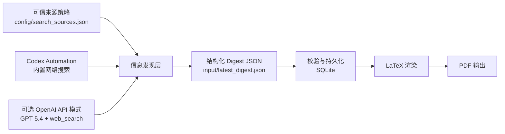

# AI Daily Digest Agent

[English](./README.md)

一个面向 AI 情报整理与日报生产的 agent 化流水线：先完成高价值信息发现与结构化整理，再生成 LaTeX/PDF 日报。

## 项目定位

该项目定位为一个可审计的 AI 情报生产系统，采用结构化输出与来源治理机制，适用于持续性的情报跟踪与报告生成。

- 通过结构化 JSON 契约，将“信息发现”和“文档渲染”解耦
- 同时支持两种运行方式：
  - `Codex automation mode`：日常本地使用，不依赖本地 API key
  - `OpenAI API mode`：用于展示与独立复现的可选模式
- 通过来源策略约束信息边界，确保发现流程可控、可审计
- 输出正式 PDF 日报，适用于归档、复核与持续跟踪

## 核心能力

1. 从可信来源范围发现近期 AI 更新
2. 严格筛选 `3-5` 条高价值内容
3. 当当天内容不足时，允许向前回补 `14` 天
4. 生成简洁中文摘要
5. 输出结构化 digest JSON
6. 渲染并编译 LaTeX PDF 日报

## 架构



## 来源范围

来源策略定义在 [config/search_sources.json](./config/search_sources.json)。

当前范围包括：

- 官方渠道
- 权威机构
- 高质量媒体
- 高信号 GitHub 社区帖子

## 运行模式

### 1. Render mode

默认本地模式。读取 automation 生成的结构化 JSON，然后渲染 PDF。该模式不需要 `OPENAI_API_KEY`。

```powershell
.\scripts\run_digest.ps1 --input input\latest_digest.json
```

### 2. API mode

可选展示模式。通过 `GPT-5.4 + web_search` 调用 OpenAI API，先生成 digest JSON，再渲染 PDF。

先安装可选依赖：

```powershell
.venv\Scripts\python -m pip install -e .[dev,api]
```

运行前需要设置 `OPENAI_API_KEY`。该要求仅适用于 `API mode`，不影响默认本地渲染流程。

运行：

```powershell
.venv\Scripts\python -m ai_news_digest --mode api --input input\latest_digest.json
```

## 示例输入

参考 [input/latest_digest.example.json](./input/latest_digest.example.json)。

## 本地安装

```powershell
python -m venv .venv
.venv\Scripts\python -m pip install --upgrade pip
.venv\Scripts\python -m pip install -e .[dev]
```

如果要使用展示型 API 路径：

```powershell
.venv\Scripts\python -m pip install -e .[dev,api]
```

## 验证

```powershell
.venv\Scripts\python -m pytest -q
.\scripts\run_digest.ps1 --input input\latest_digest.example.json --dry-run
```

## 仓库结构

- `config/search_sources.json`：可信来源与域名范围
- `input/`：结构化 digest JSON 示例
- `scripts/run_digest.ps1`：Windows 启动入口
- `src/ai_news_digest/`：核心代码
- `templates/`：LaTeX 模板
- `tests/`：自动化测试

## 适合展示给 AI agent / 软件开发岗位的点

- 清晰的 agent workflow 设计与工具边界
- 同时支持“日常自动化使用”和“可移植独立复现”的双模式
- 用结构化中间表示连接搜索发现与文档渲染
- 通过 LaTeX 生成可复用、可归档的正式 PDF 产物
- 具备 SQLite 状态持久化与测试覆盖

## 开源协议

[MIT](./LICENSE)
